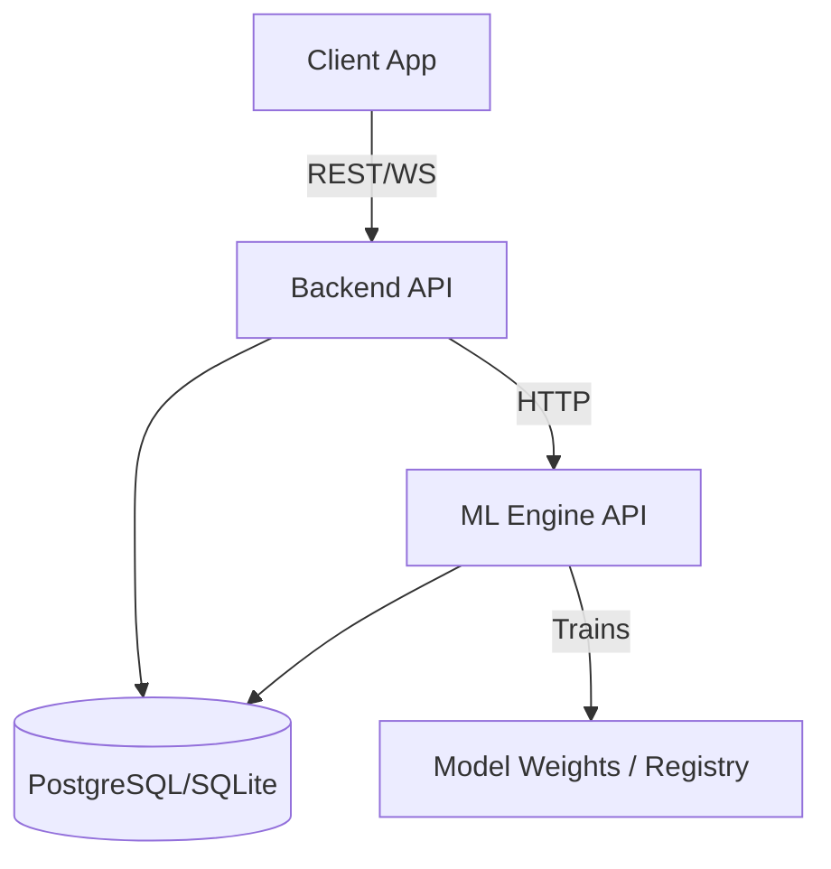
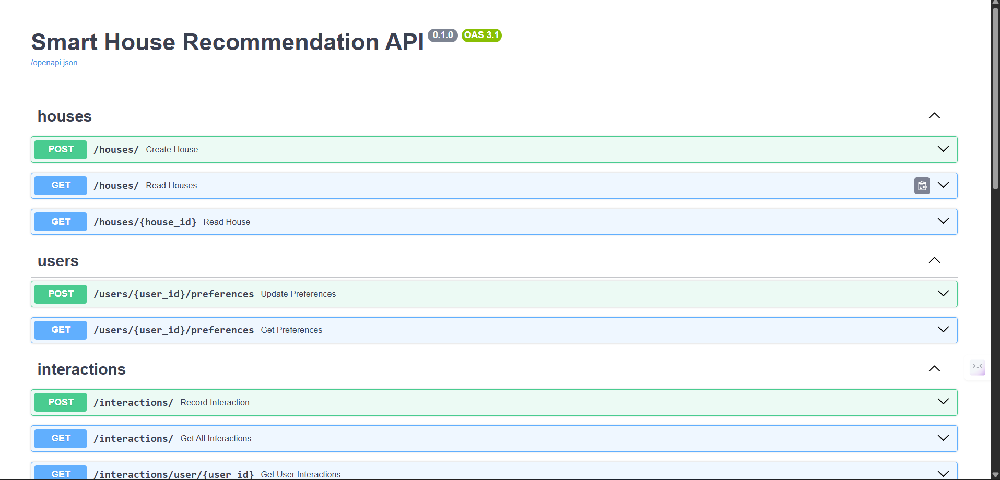
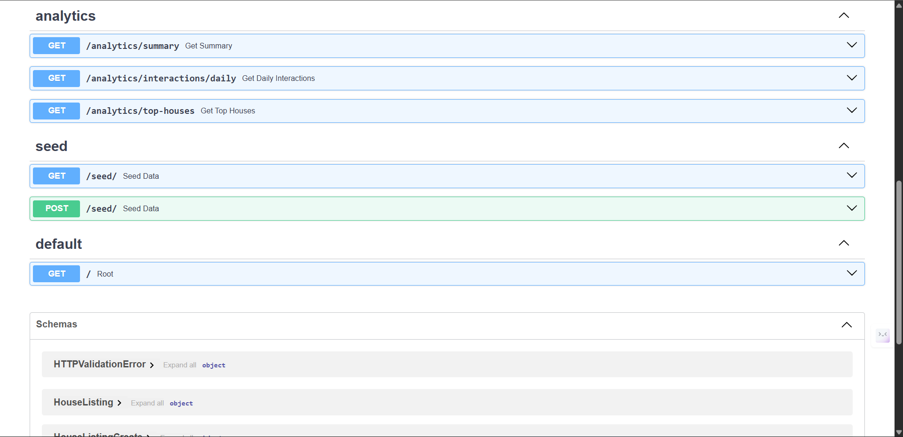
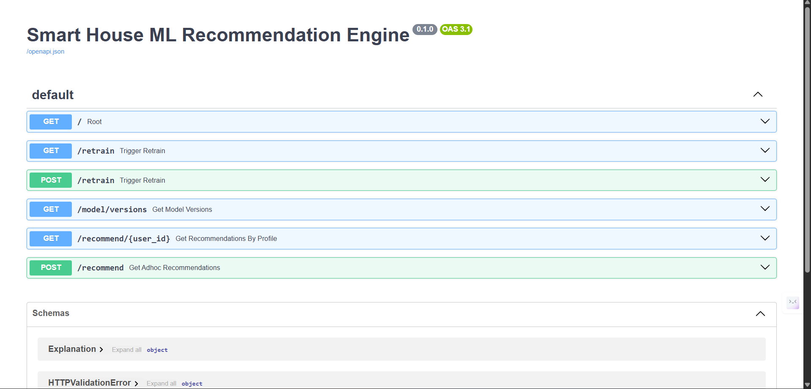
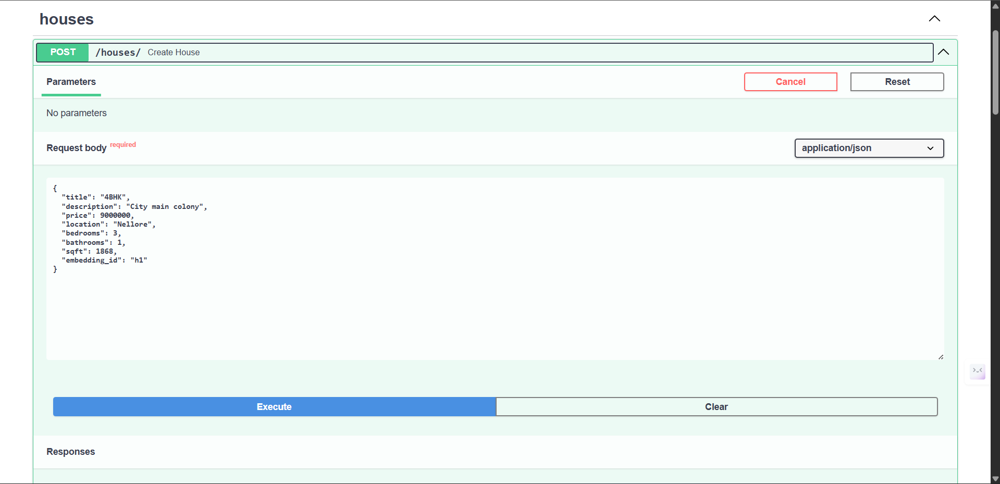
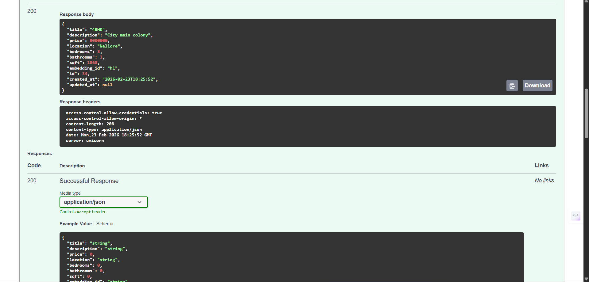
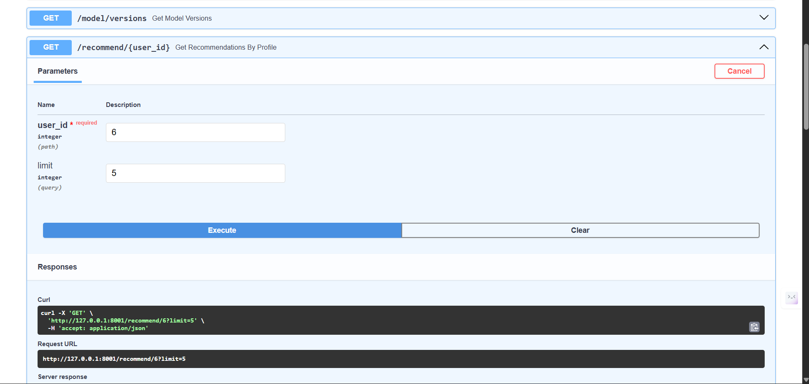
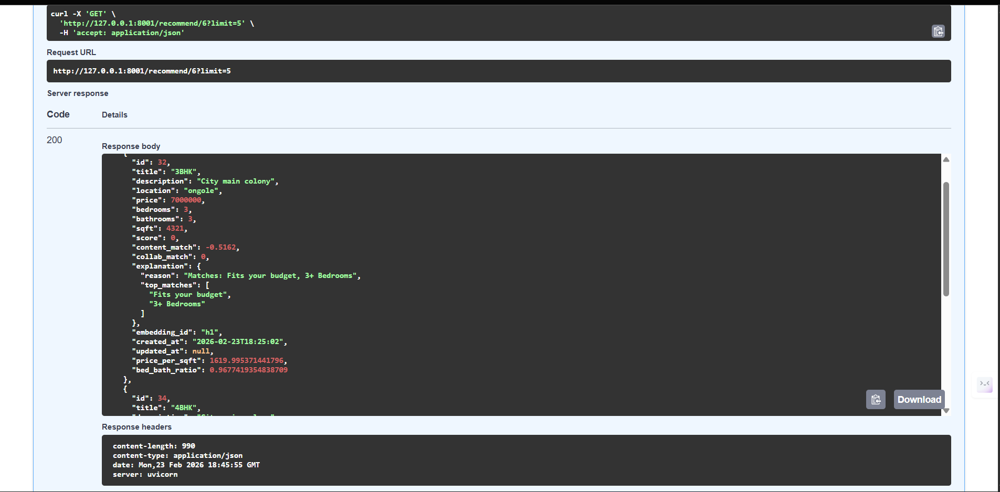

# 🏡 AI-Powered Smart House Recommendation System — Production ML Project


---

## 📌 Project Overview

The **AI-Powered Smart House Recommendation System** is a production-level machine learning system that recommends houses based on user preferences such as price range, location, and bedroom requirements.

The system uses a **Hybrid Recommendation Engine (Content-Based + Collaborative Filtering)** with strict filtering, ranking, and explainable AI to deliver personalized and intelligent recommendations. It demonstrates real-world ML pipeline design, backend architecture, and scalable recommendation systems.

---

## Architecture


---

## ⭐ Key Features

✅ Hybrid recommendation system (Content + Collaborative filtering)

✅ Strict preference-based filtering (price, location, bedrooms)

✅ Explainable AI (why each house is recommended)

✅ Real-time recommendation ranking

✅ Model training and retraining pipeline

✅ REST API backend (FastAPI)

✅ Database integration for houses and users

✅ Performance monitoring and logging

✅ Production-ready architecture

---

## 🏗 System Architecture

```
User → Mobile/Web Client → FastAPI Backend → ML Recommendation Engine → Database → Ranked Results
```

### Components

* **User Interface** — sends preferences and requests
* **Backend API** — processes requests and handles data
* **ML Engine** — filters and ranks houses
* **Database** — stores houses, users, and interactions
* **Recommendation Output** — returns ranked results

---

## 🧠 Machine Learning Pipeline

1. Data collection and preprocessing
2. Feature extraction (price, location, bedrooms, user behavior)
3. Content-based similarity calculation
4. Collaborative filtering using interaction data
5. Hybrid score computation and ranking
6. Model evaluation (Precision, Recall, F1, Accuracy)
7. Explainable AI output generation

### Recommendation Algorithm

* Content-based filtering → feature similarity matching
* Collaborative filtering → behavior-based learning
* Hybrid ranking → combined recommendation score

---

## 🔄 System Workflow

```
User Request → Filter Houses → ML Ranking → Score Normalization → Top Recommendations
```

Steps:

* User provides preferences
* System filters matching houses
* ML model ranks houses
* Top results returned with explanation

---

## 📊 Performance Metrics

* Average API response time: ~100–200 ms
* Model training time: few seconds (dataset dependent)
* Recommendation ranking complexity: O(n log n)
* Scalable architecture for large datasets

---

## 🧪 Testing & Validation

* Unit testing for API endpoints
* Input validation and error handling
* Data validation checks
* Secure request handling

---

## 🚀 Deployment

### Run with Docker (Production Setup)

```
docker build -t house-recommendation .
docker run -p 8000:8000 house-recommendation
```

### Local Development

```
pip install -r requirements.txt
uvicorn apps.backend_api.main:app --reload
```
```
Backend : python -m uvicorn apps.backend_api.main:app --reload --port 8000
ML Engine : python -m uvicorn apps.ml_engine.main:app --reload --port 8001

```

Open API Docs:

```
http://localhost:8000/docs
http://localhost:8001/docs
```

---

## ⚙️ Tech Stack

* Python
* FastAPI
* Scikit-learn
* Pandas / NumPy
* SQLite / SQL Database
* REST API Architecture
* Docker Deployment
* Machine Learning Pipeline

---

## 📂 Project Structure

```
apps/
 ├── backend_api/        # FastAPI backend and routes
 ├── ml_engine/          # Recommendation engine and training
 └── mobile_app/         # Frontend client (optional)

docs/                    # Documentation
infra/                   # Deployment configuration
models/                  # Saved ML models
```

---

---

## 📸 Demo


### 🏡 House Recommendation API

Personalized house recommendations based on user preferences.




---

### ⚙️ ML Recommendation Engine

Hybrid recommendation system generating ranked results with explainable AI.



---

### 👤 User Preferences

User sets preferences like price range, location, and bedrooms.




---

### 📊 Output

System analytics including user activity and performance metrics.





---

## 🎯 Applications

* Real estate recommendation platforms
* Personalized search systems
* E-commerce recommendation engines
* Intelligent decision support systems

---

## ⚠️ Limitations

* Performance depends on available user data
* Cold-start problem for new users
* Recommendation quality improves with more interactions

---

## 🚀 Future Improvements

* Cloud deployment (AWS / GCP)
* Deep learning recommendation models
* Real-time analytics dashboard
* Large-scale distributed training

---

## Output Links 

* Backend : http://localhost:8000/docs

* Ml Engine : http://localhost:8001/docs

---

## 👨‍💻 Author

**Hemanth Gudi**
Computer Science Student | Full Stack Developer | Machine Learning Enthusiast


